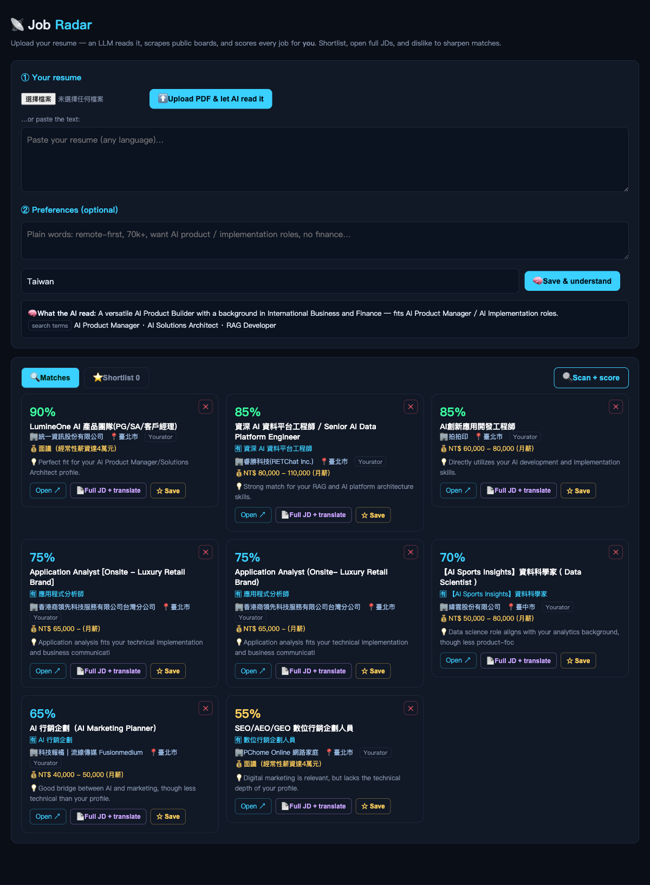

# 📡 Job Radar

**English** · [繁體中文](README.zh-TW.md)

Upload your resume → an LLM builds your profile, scrapes public job boards, and
**ranks every posting 0–100 against *your* resume** — each with a one-line
reason. Open the full JD (optionally translated), shortlist the good ones, and
dislike the bad ones so future scans steer away from them.

No account, no database, no tracking. One Python file + one HTML page. Bring
your own LLM key.



## Why

Job boards rank by *their* relevance and drown you in noise. Job Radar reads
your actual resume and scores each posting for **you** — "90% · perfect fit for
your AI Product Manager profile" beats scrolling 200 listings.

## Features

- **Resume → profile** — upload a **PDF** (or paste text, any language); the LLM
  extracts your level, domain, skills, and the search keywords to query with.
- **Per-job AI fit score** 0–100 with a specific reason — not keyword matching.
- **Full job description** on demand, with an **optional translation** (set
  `TRANSLATE_JD_TO`, e.g. `Traditional Chinese`).
- **Custom hard preferences** — "remote only, 70k+, no finance" become the
  top-priority matching standard.
- **Shortlist** (⭐) the ones you like; **dislike** (✕) the ones you don't — and
  similar jobs score lower next time.
- **Public sources, no login** — Yourator API + LinkedIn guest search.
- Everything persists to `./data/*.json`. Delete it to reset.

## Quick start

### Option A — Docker (nothing to install)

```bash
cp .env.example .env          # add your OPENAI_API_KEY
docker compose up
```

### Option B — Python

```bash
cp .env.example .env          # add your OPENAI_API_KEY
./run.sh                      # creates a venv, installs deps, starts the server
```

Then open **http://127.0.0.1:8080** → upload your resume → **Scan + score**.

## Configuration (`.env`)

| Var | Default | What |
|---|---|---|
| `OPENAI_API_KEY` | — | **Required.** Your key. |
| `OPENAI_BASE_URL` | `https://api.openai.com/v1` | Any OpenAI-compatible endpoint (Ollama, LM Studio, Groq, Together, a proxy…). |
| `OPENAI_MODEL` | `gpt-4o-mini` | Model name. |
| `JOB_LOCATION` | `Taiwan` | Location passed to LinkedIn's search (e.g. `Remote`, `London`, `United States`). |
| `TRANSLATE_JD_TO` | *(off)* | If set, adds a translate step on full JDs (e.g. `Traditional Chinese`). |
| `PORT` | `8080` | Server port. |

### Using a local / alternative LLM

Point `OPENAI_BASE_URL` at any OpenAI-compatible server — e.g. Ollama
(`http://localhost:11434/v1`), LM Studio, Groq, Together, or a Gemini
OpenAI-compat proxy. Set `OPENAI_MODEL` accordingly.

## How it works

1. `POST /api/resume` (PDF) or `/api/analyze` (text) → `{summary, terms}` saved to `data/profile.json`.
2. `POST /api/scan` — scrape by `terms` → dedup, drop disliked → LLM scores the
   top ~24 against your profile + preferences → sorted cards.
3. `POST /api/jd` — fetch a posting's full description (LinkedIn guest API or the
   page's JSON-LD), cache it, optionally translate.
4. `POST /api/save` / `/api/dislike` — shortlist / negative signal, persisted.

## Adding job sources

`fetch_yourator()` / `fetch_linkedin()` in `app.py` each return a list of
`{source, title, company, loc, salary, url}` dicts. Add a `fetch_yoursite()` in
the same shape and include it in `scan()` — the scoring and UI need no changes.

## Notes

- Scrapers hit public endpoints politely; respect each site's terms of use.
- 104 is intentionally not scraped (Cloudflare + SPA) — it breaks constantly.
- This is the standalone, bring-your-own-LLM version. It grew out of a personal
  assistant ([owen4sure/jarvis](https://github.com/owen4sure/jarvis)), where the
  same radar also does deep company research and one-click LinkedIn apply.

## License

MIT
